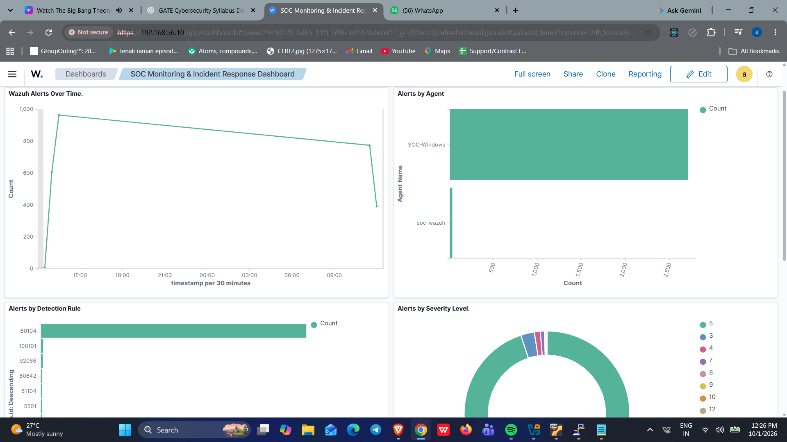
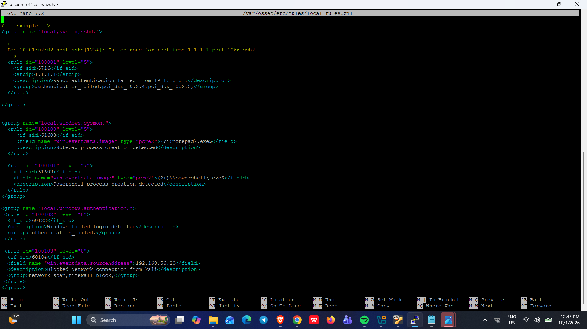
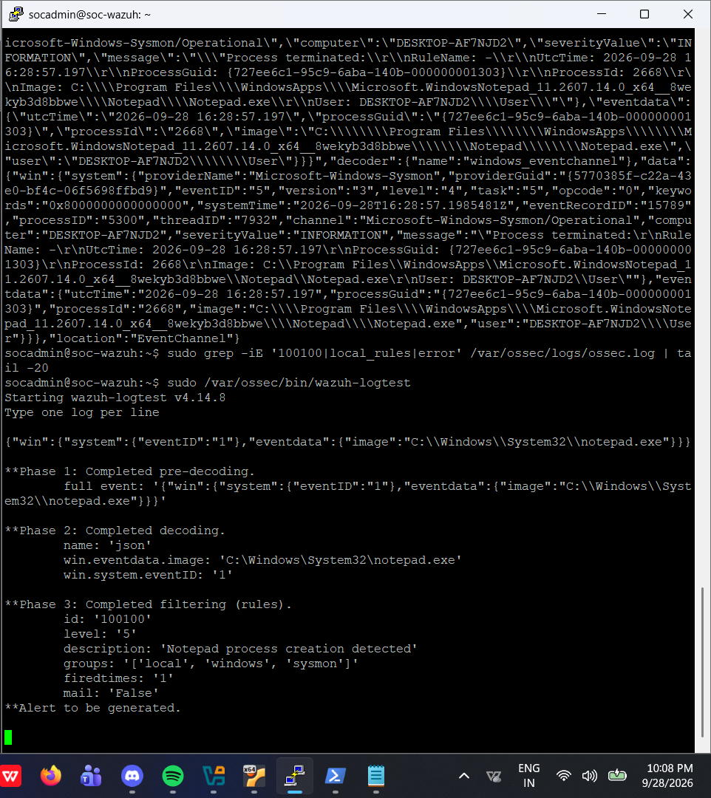
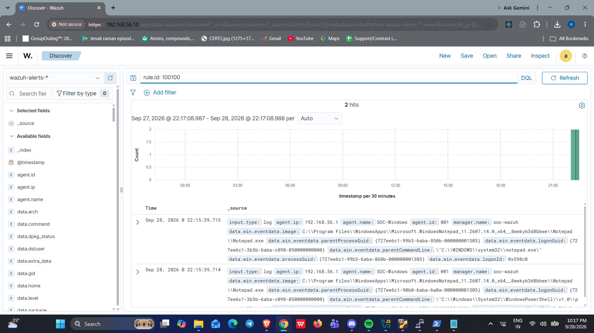
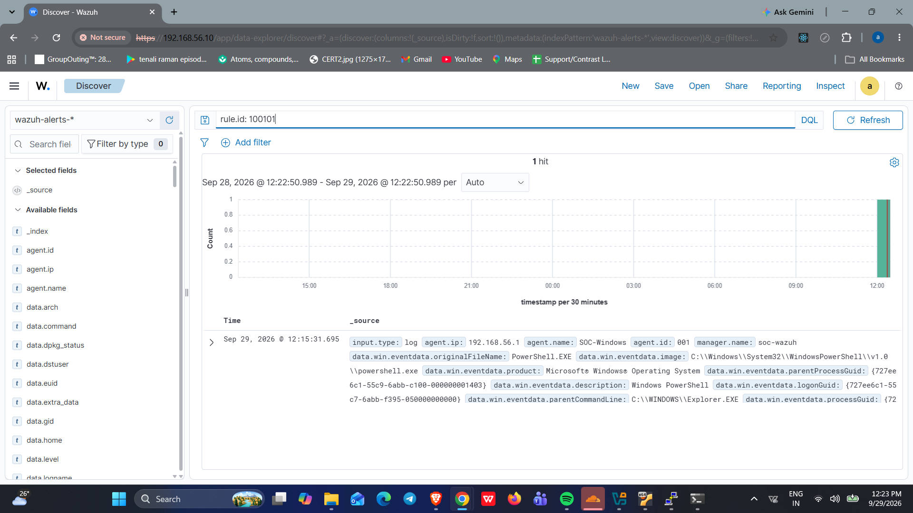
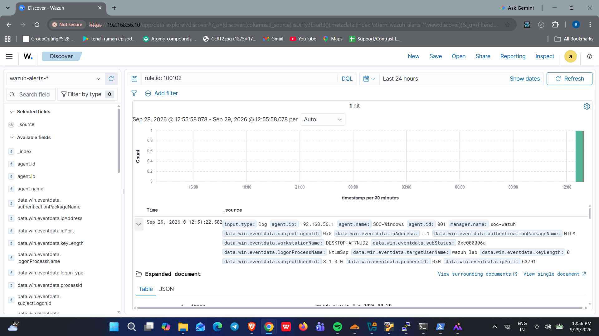
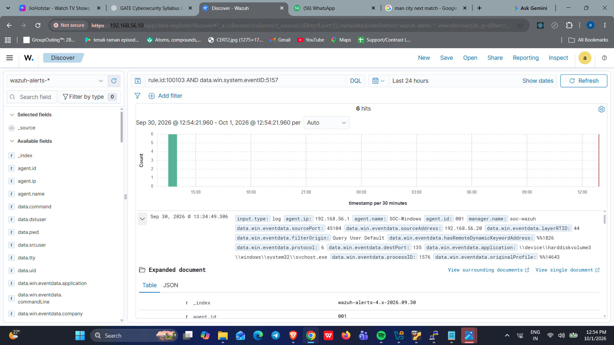

SOC Detection & Incident Response Lab
A hands-on Security Operations Center (SOC) home lab built with Wazuh
SIEM, Ubuntu Server, Windows, and Kali Linux. The lab demonstrates
endpoint monitoring, custom detection rules, alert analysis, and
incident investigation.
---
Project Overview
The goal of this project is to build a functional SOC environment,
generate controlled security events, detect suspicious activity,
investigate alerts, and document findings.
Wazuh is used to collect and analyze Windows endpoint logs. Kali Linux
is used to perform a controlled Nmap scan to validate network-event
detection.
Lab Architecture
SIEM: Wazuh 4.14
SIEM server: Ubuntu Server 24.04.5 LTS
Monitored endpoint: Windows
Attack simulation: Kali Linux
Virtualization: Oracle VirtualBox
Remote access: PuTTY
Log sources: Wazuh Agent, Windows Event Logs, and Sysmon
Networking: NAT and Host-only Adapter
Network Configuration
Wazuh Server: `192.168.56.10`
Windows Host: `192.168.56.1`
Kali Linux: `192.168.56.20`
Tools & Technologies
Wazuh SIEM --- Security event collection, alert monitoring, and
threat detection.
Ubuntu Server --- Hosts the Wazuh manager and dashboard.
Windows --- Monitored endpoint generating security and Sysmon
events.
Sysmon --- Provides detailed process-creation and
system-activity logs.
Kali Linux --- Used for controlled network scanning and attack
simulation.
Nmap --- Used to simulate network reconnaissance.
VirtualBox --- Provides the virtualized lab environment.
PuTTY --- Provides SSH access to the Ubuntu server.
Custom Detection Rules
Four custom Wazuh rules were created and tested:
`100100` --- Notepad process creation  
Severity: Level 5
`100101` --- PowerShell process creation  
Severity: Level 7
`100102` --- Windows failed login  
Severity: Level 8
`100103` --- Blocked network connection from Kali  
Severity: Level 8
Detection Scenarios
1. Process Creation Monitoring
Monitors Windows Sysmon process-creation events.
Detects Notepad and PowerShell execution.
Uses custom rules `100100` and `100101`.
2. Failed Login Detection
Detects failed Windows authentication events.
Uses Windows Event ID `4625`.
Custom rule: `100102` (Level 8).
3. Network Scan Detection
Runs a controlled Nmap scan from Kali Linux against the Windows
host.
Monitors Windows Filtering Platform Event ID `5157`.
Detects blocked connection attempts from the Kali source address.
Custom rule: `100103` (Level 8).
Investigations
Windows Failed Login
A failed-login scenario was generated on the Windows endpoint to test
authentication monitoring.
Detection details - Windows Event ID: `4625` - Custom Wazuh rule:
`100102` - Severity: Level 8
The alert was verified in the Wazuh dashboard and documented in the
investigation report.
Read the Failed Login
Investigation
Nmap Network Scan
A controlled Nmap scan was performed from Kali Linux against the Windows
host. The scan targeted ports `135`, `139`, `445`, and `3389`, which
were reported as filtered.
Windows Filtering Platform generated Event ID `5157` for blocked
connections. Wazuh collected the matching events, and custom rule
`100103` generated alerts.
Detection details - Source IP: `192.168.56.20` - Windows Event ID:
`5157` - Custom Wazuh rule: `100103` - Severity: Level 8
Read the Nmap Network Scan
Investigation
Wazuh Dashboard
A custom SOC dashboard was created to visualize security alerts and
monitor endpoint activity. It includes:
Wazuh Alerts Over Time
Alerts by Detection Rule
Alerts by Severity Level
Custom Detection Alerts
Alerts by Agent

Detection Evidence
Custom Detection Rules

Notepad Process Detection

Notepad Alert

PowerShell Alert

Failed Login Alert

Nmap Detection Alert

Nmap Scan

Wazuh Alert Details

Project Structure
``` text
SOC-Home-Lab/
├── README.md
├── setup-guide.md
└── investigation/
    ├── failed-login-investigation-report.md
    ├── nmap-scan-investigation.md
    └── Screenshots_evidence/
        ├── Wazuh-dashboard.png
        ├── custom-rules.png
        ├── failed-login-alert.png.png
        ├── nmap-detection-alert.png.png
        ├── nmap_scan.png
        ├── notepad-alert.png.png
        ├── notepad-detection.png.png
        ├── powershell-alert.png.png
        └── wazuh-alert-details.png.png
```
Skills Demonstrated
SIEM deployment and configuration
Security event monitoring
Windows Event Log analysis
Sysmon log analysis
Custom Wazuh detection rule creation
Network reconnaissance simulation
Firewall event investigation
Alert triage and incident documentation
Virtual machine and network configuration
Conclusion
This project demonstrates a hands-on SOC environment for practicing
security monitoring, detection engineering, and incident investigation.
It combines endpoint telemetry, controlled network scanning, custom
Wazuh rules, and dashboard visualizations to demonstrate a basic
security monitoring and incident-response workflow.
Disclaimer
This project was developed for educational purposes in a controlled lab
environment. All simulations and testing were performed on systems under
my control.
