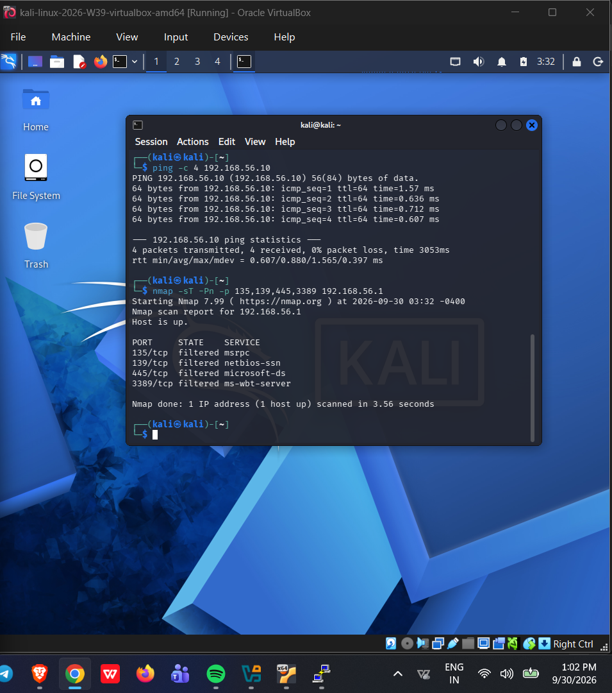
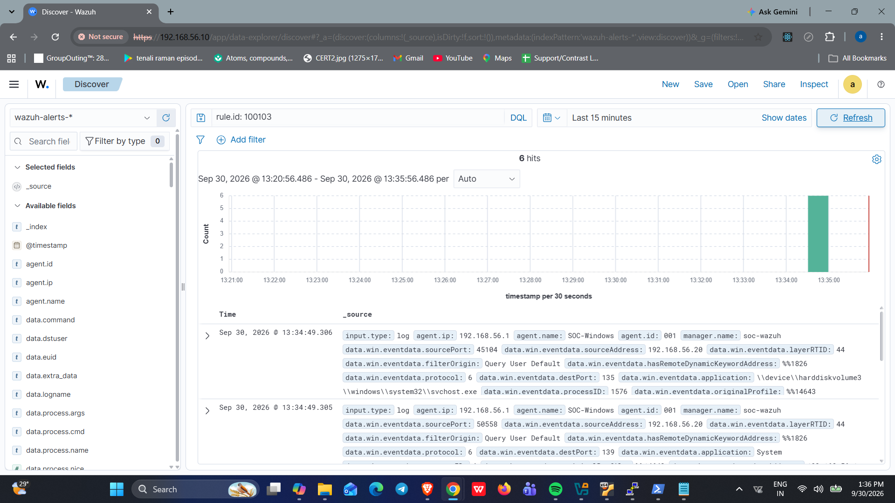

# Incident Investigation: Nmap Network Scan

> **Environment:** Controlled SOC home-lab simulation  
> **Source:** Kali Linux  
> **Target:** Windows endpoint monitored by Wazuh

## 1. Investigation Overview

| Field | Details |
|---|---|
| Investigation Type | Network Scanning |
| Source Machine | Kali Linux |
| Target Machine | Windows |
| Detection Platform | Wazuh SIEM |
| Detection Rule | `100103` |
| Windows Event ID | `5157` |
| Severity Level | 8 — High |

## 2. Objective

The objective of this investigation was to simulate network reconnaissance using Nmap from Kali Linux and verify whether Wazuh could detect blocked network connection attempts through Windows Firewall events.

## 3. Lab Environment

| Component | Configuration |
|---|---|
| SIEM | Wazuh 4.14 |
| SIEM Server | Ubuntu Server 24.04 |
| Attacker Machine | Kali Linux |
| Target Machine | Windows |
| Kali Linux IP | `192.168.56.20` |
| Windows Host IP | `192.168.56.1` |
| Custom Wazuh Rule | `100103` |

## 4. Attack Simulation

A network scan was performed from Kali Linux against the Windows host using Nmap.

The scan targeted the following ports:

- **135** — Microsoft RPC
- **139** — NetBIOS
- **445** — SMB
- **3389** — Remote Desktop Protocol (RDP)

The Nmap command used was:

```bash
nmap -sS -Pn -p 135,139,445,3389 192.168.56.1
```

The scanned ports were reported as **filtered**, indicating that Nmap did not receive responses that allowed it to determine whether the ports were open or closed.

## 5. Detection and Log Analysis

Windows Filtering Platform connection auditing was enabled to capture blocked connection attempts.

Windows generated **Security Event ID `5157`**, indicating that Windows Filtering Platform blocked a connection.

The Wazuh agent collected these events and forwarded them to the Wazuh manager for analysis.

A custom Wazuh rule, **`100103`**, was configured to detect blocked connections originating from the Kali Linux IP address.

### Custom Detection Rule

| Attribute | Value |
|---|---|
| Rule ID | `100103` |
| Rule Level | 8 |
| Windows Event ID | `5157` |
| Source IP | `192.168.56.20` |
| Description | Blocked Network connection from kali |
| Detection Category | Network Scan / Firewall Block |

## 6. Alert Verification

The custom rule successfully generated alerts when blocked connection events from Kali Linux were received.

The alerts were verified in both the Wazuh dashboard and the `alerts.json` log file.

During verification, the dashboard displayed **six events** matching rule ID `100103`.

## 7. Investigation Findings

- Nmap scanning activity was performed from Kali Linux against the Windows host.
- The targeted ports were reported as filtered.
- Windows generated Event ID `5157` for blocked connection attempts.
- Wazuh successfully received and processed the relevant events.
- Custom rule `100103` generated Level 8 alerts for matching traffic from Kali Linux.
- The detection demonstrated that Wazuh could identify and alert on the simulated blocked network activity.

## 8. Incident Response

The activity was a controlled network scan conducted within the lab environment.

The investigation confirmed that the firewall blocked the scanned connections and that Wazuh detected the associated events.

In a real SOC environment, an analyst should:

1. Review the source and destination IP addresses.
2. Examine the targeted ports and connection patterns.
3. Correlate firewall events with other endpoint and network logs.
4. Determine whether the activity is authorized or suspicious.
5. Escalate the incident if further investigation is required.

## 9. Conclusion

This investigation demonstrated the integration of Windows Firewall auditing with Wazuh SIEM.

The Nmap scan generated blocked connection events, which were collected by the Wazuh agent and matched by custom rule `100103`.

The successful alert generation validated the custom detection rule and demonstrated a basic network reconnaissance detection workflow in the SOC home lab.

## 10. Evidence

The Nmap scan and corresponding Wazuh alert screenshots are available in the `Screenshots_evidence` folder.

Nmap Scan: 


Nmap Detection Alert: 



